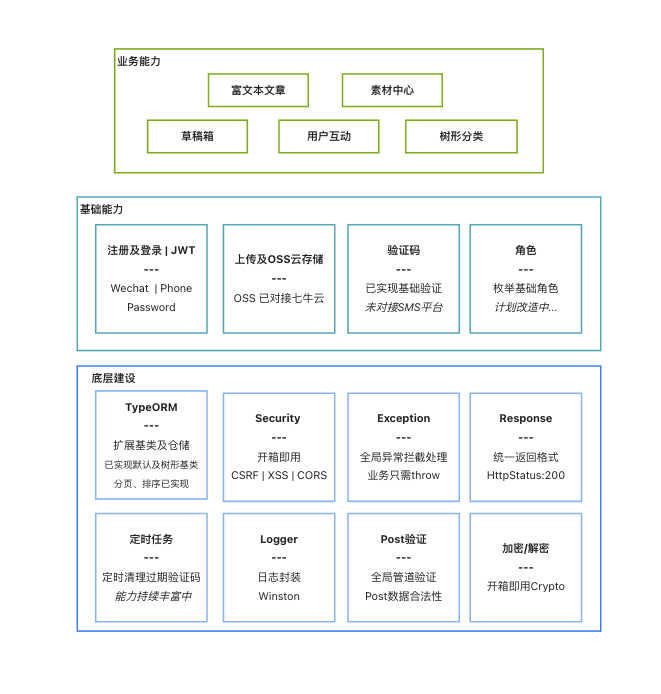
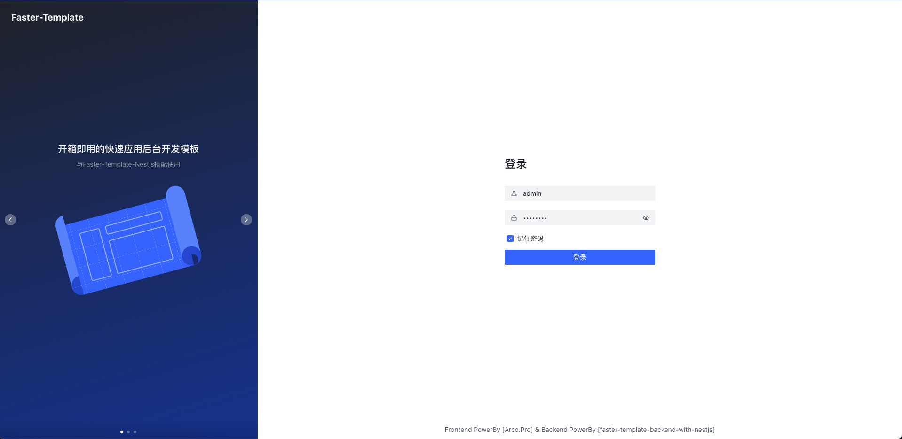
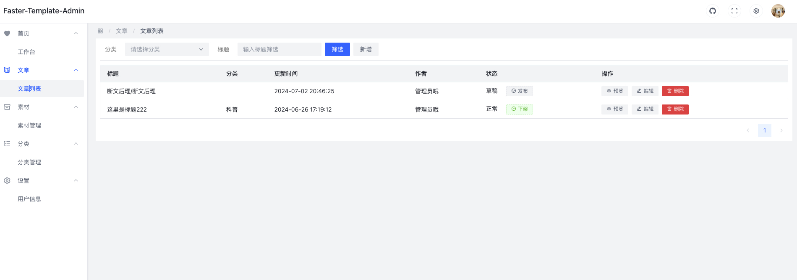

<div align="center">
  <h1>faster-template快速模板管理端</h1>
  <h2>⭐️后端项目 <a href="https://github.com/heifengli001/faster-template-backend-with-nestjs">faster-template-backend-with-nestjs</a>⭐️</h2>
</div>

## 🤖 简介
该项目是后端[faster-template-backend-with-nestjs](https://github.com/heifengli001/faster-template-backend-with-nestjs)的前端实现，
关于后端服务已有能力可前往查看已支持的功能

### 后端实现能力
<p align="center">
</p>


## 🎯 目标
 做一个开箱即用的快速开发模板。前端开发人员无需关注底层建设，只需要关心新增业务。

相比ServerLess，它的后台部分不会因为过多因素而导致臃肿和冗余，完全贴近国内前端开发人员习惯，支持迅速接入微信登录，云OSS。

模板底层已实现JWT,CSRF,XSS,CORS，配置清晰，模块明确。

将全面使用NodeJS(NestJS)+TypeScript 进行后台动能开发。

## 说明：
### 精简内容
该前端项目使用`Arco-pro` 的simple模板初始化。为保证项目足够轻巧而不臃肿，已将`arco`中部分内容进行删除，但仍有许多多余内容需要清理及优化，目前仍在持续进行中。

Done:
+ 多语言不再持续支持
+ 切换主题不再支持

Todo:
+ 角色权限将使用其他方式实现
+ Axios将修改为建立单例而不是在原生axios上增加
+ more ... 

### 还在初期
该前端项目目前只是初版，仍有较多优化地方请勿直接使用。更多功能的前端实现扔在持续迭代。前端项目将和后端项目一起逐步迭代，但仍然优先后端项目的功能实现为主。

## 已实现功能
+ 用户登录及个人设置
+ 内容管理
    + 用户互动(评论，赞)
+ 草稿箱
+ 素材管理
    + 媒体资源上传及默认压缩
+ 分类管理
+ 底层安全支持（CSRF/XSS/CORS）

## 待实现
+ 角色及权限重新调整
+ 用户管理
+ 微信小程序登录接入（公众号认证已接入）
+ More ... 

## 技术栈
+ Vue3 + pinia + TypeScript
+ UI: Arco


## 在线Demo
🚀后端服务项目：https://github.com/heifengli001/faster-template-backend-with-nestjs

+ 地址：https://ft.heifengli.top
+ 用户名：admin
+ 密码：Admin123

### 登录
<p align="center">
</p>

### 内页
<p align="center">

</p>

---

## 开发
> 该前端基于 Vue3(vue-router+pinia) + Arco-Design开发。

+ [Vue3](https://cn.vuejs.org/api/)
+ [vue-router](https://router.vuejs.org/zh/)
+ [Pinia](https://pinia.vuejs.org/zh/getting-started.html)
+ [Arco](https://arco.design/vue/docs/pro/start)

### 安装
+ https
``` bash | zsh
git clone  https://github.com/heifengli001/faster-template-frontend-admin-with-arco.git
```
+ ssh
``` bash | zsh
git clone git@github.com:heifengli001/faster-template-frontend-admin-with-arco.git
```

### 运行
> 包管理器`!!! 务必使用` `pnpm` 而不是 `npm`

项目默认启动在`端口：4000`上
```
# 安装依赖
pnpm install
# 运行
pnpm run dev
```
#

### 运行后端服务
详见：🚀后端服务项目 https://github.com/heifengli001/faster-template-backend-with-nestjs

## 部署

前端的部署很简单，就两步
1. 打包
2. 静态托管

### 打包 
> 打包请确认安装`vue-tsc` ，config 文件已准备就绪

```
npm run build
// 实际命令
// vue-tsc --noEmit && vite build --config ./config/vite.config.prod.ts
```
### 静态托管
如果你有自己的服务器，你可直接将打包后的文件上传到你服务器的目录，然后使用Nginx进行配置访问

或者你可以使用其他免费的静态托管平台，如`netlify`和`vercel`

如果你在你自己的服务器上进行静态托管，因为项目是`SPA+historyMode`请务必在`Nginx`设置`tryfiles`规则

```
    # SPA页面配置tryfiles
    location / {
        try_files $uri $uri/ /index.html;
    }
```
### 附：如何使用webhook自动部署

参考文章：[【NestJS应用从0到1】11.部署及git-hook自动部署](https://juejin.cn/post/7387291151735275529)

上面文章是部署NestJS后端应用程序，前端和NestJS的流程类似，但最终打包前端只需要静态托管，无需启动服务

如果你也刚好是使用webhook自动部署，在deploy文件夹下已经准备好了`webhook脚本`以及`服务重启`脚本

/deploy 文件如下：
+ `prepare.sh` 如果你的开发机没有 `pnpm` 环境，可参考本脚本使用wget安装
+ `webhook.sh` webhook触发时执行的脚本;用于拉取仓库以及执行`restart.sh`
+ `restart.sh` 重启脚本；用于删除原目录，重新build新文件，build完成后删除源代码